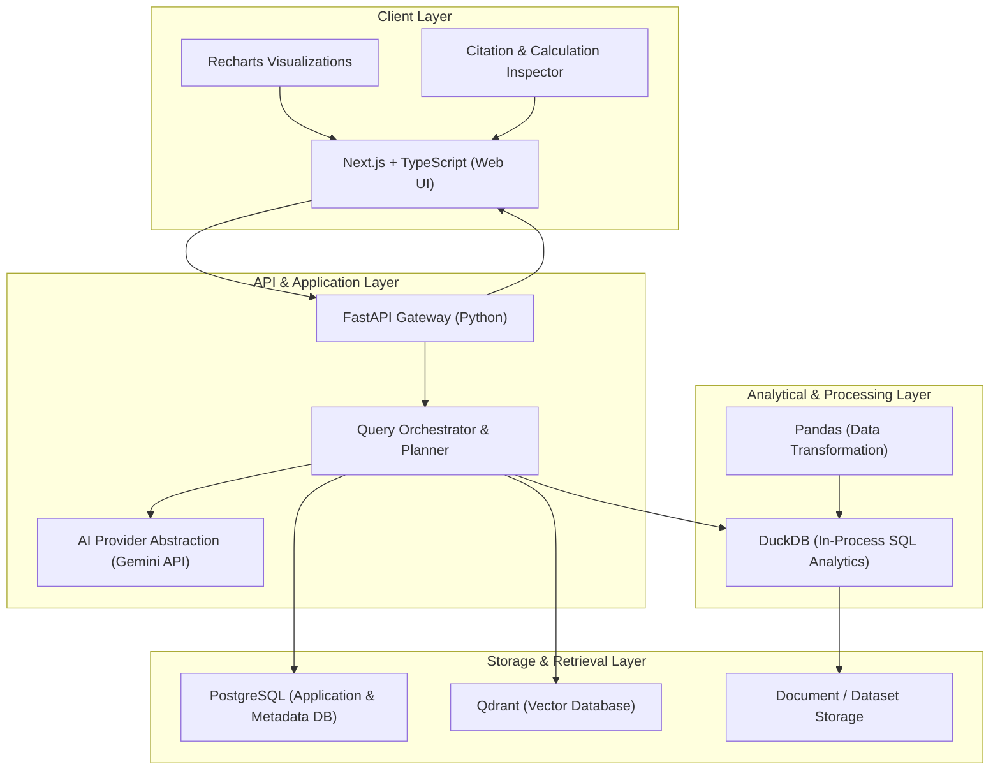

# OpenCitizen AI - Architecture

OpenCitizen AI is designed as a modular, evidence-grounded intelligence platform. Its primary goal is enabling citizens, researchers, and analysts to question public records, municipal documents, budgets, and civic datasets with absolute transparency—allowing users to inspect the exact citations, source text, and mathematical calculations behind every answer.

---

## High-Level Architecture Diagram



---

## Core Technology Stack

| Layer | Technology | Purpose |
| :--- | :--- | :--- |
| **Frontend Web App** | **Next.js (React) + TypeScript** | Modern, performant UI with server-side rendering and responsive citizen dashboards. |
| **Data Visualizations** | **Recharts** | Declarative charting for trends, budget breakdowns, time-series, and demographic data. |
| **Backend API** | **FastAPI (Python)** | High-performance asynchronous REST and WebSocket API endpoints. |
| **Analytical Engine** | **DuckDB** | Fast analytical SQL queries directly over CSV, Parquet, and relational civic datasets. |
| **Vector Database** | **Qdrant** | Semantic retrieval of unstructured document passages (PDFs, reports, meeting minutes). |
| **Application Database** | **PostgreSQL** | User accounts, workspace configurations, audit logs, and document metadata. |
| **Data Processing** | **Pandas** | Tabular data normalization, cleaning, and preprocessing pipelines. |
| **AI Integration** | **Gemini API** | Large language model reasoning accessed via a strictly typed provider abstraction. |
| **Orchestration** | **Docker Compose** | Local and staging multi-container environment (API, Postgres, Qdrant). |

---

## Architectural Principles

### 1. Evidence Grounding Before Generation
Answers are never synthesized purely from LLM parametric memory. Every factual claim must be backed by a verified document passage (via Qdrant) or a computed analytical result (via DuckDB).

### 2. Dual-Path Retrieval & Analysis
* **Unstructured Documents (PDFs, Policy Briefs, Reports):** Chunked, embedded, and indexed into Qdrant for semantic search with page-level citations.
* **Structured Data (Budgets, CSVs, Parquet, Tables):** Registered with DuckDB for exact SQL execution (sums, averages, groupings) to avoid LLM mathematical hallucinations.

### 3. Clean AI Provider Abstraction
The application interacts with LLMs through an abstracted interface (`AIProvider` protocol), keeping the codebase decoupled from any single vendor SDK and facilitating mocking during automated testing.

### 4. Full Auditability
Every response packet returned to the frontend carries:
* **Source Citations:** Document ID, title, page number, and original excerpt.
* **Calculation Steps:** The exact SQL query executed in DuckDB and raw tabular output.

---

## Repository Organization

```
opencitizen-ai/
├── frontend/          # Next.js web application and UI components
├── backend/           # FastAPI application, business logic, and API routes
├── data-pipeline/     # Ingestion, cleaning, chunking, and embedding scripts
├── docs/              # System documentation, specifications, and guides
├── tests/             # End-to-end and cross-service integration tests
├── scripts/           # Local development, database migration, and seed scripts
├── docker-compose.yml # (Planned) Multi-container infrastructure definition
├── ARCHITECTURE.md    # Architecture and technical design document
├── ROADMAP.md         # Project milestones and feature status
├── CONTRIBUTING.md   # Guidelines for contributing
├── CODE_OF_CONDUCT.md# Community guidelines
├── SECURITY.md        # Vulnerability reporting and security policies
└── README.md          # Project overview, setup, and status
```
