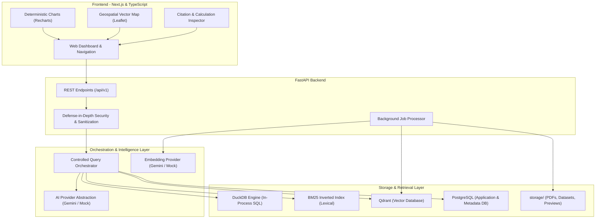

# OpenCitizen AI

An evidence-grounded, open-source AI platform enabling citizens, researchers, and public-interest organizations to upload public policy documents and tabular civic datasets, ask questions, perform verifiable data analysis, generate charts, and inspect the exact sources, citations, and calculations behind every answer.

---

[](https://github.com/syed-awais-shah-tech/opencitizen-ai/actions/workflows/ci.yml)
[](LICENSE)
[](https://www.python.org/)
[](https://nextjs.org/)
[](https://www.postgresql.org/)
[](https://duckdb.org/)
[](https://qdrant.tech/)

---

## Core Invariants

1. **Evidence Grounding Before Generation**: Factual answers are synthesized strictly from retrieved document passages or computed dataset records. Factual claims without evidence are rejected.
2. **Transparent Mathematical Calculations**: Numbers and statistical aggregations are computed deterministically via an in-process SQL analytical engine (**DuckDB**) rather than guessed via LLM token probability.
3. **Inspectable Provenance**: Every response provides an interactive evidence drawer displaying the source document, page number, citation text, and exact analytical SQL query run.
4. **Controlled Tool Orchestration**: Natural language questions are routed deterministically into document retrieval, structured analysis, hybrid execution, or unsupported handling. Arbitrary model-generated SQL is never executed directly.
5. **Defense-in-Depth Security**: File uploads, SQL keywords, entity identifiers, and user prompts pass multi-vector sanitization, magic byte checks, and size thresholds.

---

## Platform Capabilities

- [x] **Multi-Page Responsive Web Application**: Modern Next.js and TypeScript frontend featuring datasets exploration, document inspection, interactive query interface, and evidence drawer.
- [x] **FastAPI Asynchronous Gateway**: High-performance REST API with structured Pydantic schemas, domain exceptions, and sanitized error responses.
- [x] **Relational Application Persistence**: PostgreSQL database managed via SQLAlchemy and Alembic migrations for application metadata, audit trails, and dataset schemas.
- [x] **Page-Preserving PDF Ingestion**: Text extraction pipeline preserving page numbers, cleaning typography, splitting into semantically coherent chunks, and attaching traceability metadata.
- [x] **Dense Vector Search**: Qdrant vector database integration with an abstract embedding provider for semantic passage indexing and top-k nearest-neighbor retrieval.
- [x] **Grounded RAG Pipeline**: Evidence-grounded generation using Gemini reasoning with strict system instructions, citation extraction, and fallback phrases for insufficient evidence.
- [x] **Inspectable Trust Layer**: Structured confidence and provenance metadata exposing source documents, page numbers, text snippets, and model identifiers without fabricated vanity scores.
- [x] **Structured Dataset Ingestion**: Ingests CSV, XLSX, and JSON files, automatically detecting formats, inferring column data types, and computing null-value distributions.
- [x] **DuckDB Analytical Engine**: Controlled analytical query service performing counts, sums, averages, min/max, filtering, grouping, and sorting over civic datasets.
- [x] **Query Orchestration & Routing**: Intent classifier and tool router determining whether user questions require document search, SQL analytics, both, or neither.
- [x] **Deterministic Data Visualizations**: Generates safe chart configurations (bar, line, pie, table) derived strictly from actual analytical results—never fabricated by the LLM.
- [x] **Hybrid Retrieval (RRF)**: Combines dense vector retrieval (Qdrant) and lexical keyword search (BM25) prioritized through Reciprocal Rank Fusion.
- [x] **Automated Evaluation Benchmark**: Reproducible benchmark framework measuring retrieval precision, citation accuracy, answer correctness, unsupported claims, and query latency.
- [x] **Defense-in-Depth Security**: Upload size thresholds, magic byte validation, path traversal guards, prompt injection defense, SQL keyword filtering, and automated secret scrubbing.
- [x] **Asynchronous Ingestion Jobs**: Non-blocking background worker queue tracking document processing through queued, processing, completed, and failed states.
- [x] **External Civic Data Connectors**: Pluggable connector abstraction (fetch → validate → normalize → record provenance → store) for public data feeds.
- [x] **Geospatial Analytics & Mapping**: GeoJSON coordinate validation, spatial bounding, and interactive Leaflet vector map visualization.
- [x] **Continuous Integration (GitHub Actions)**: Automated CI workflow executing Ruff linting, 265+ backend unit/integration tests, TypeScript type checks, and Next.js production builds.
- [x] **Open-Source Readiness**: Issue templates, PR template, developer guides, extension tutorials, and architectural specifications.

---

## High-Level Architecture



---

## Technology Stack

| Layer | Technology | Purpose |
| :--- | :--- | :--- |
| **Frontend Web App** | Next.js 15, React, TypeScript | Citizen dashboards, document viewer, dataset explorer, evidence inspector |
| **Visualizations** | Recharts, Leaflet | Dynamic analytical charts and interactive geospatial map viewer |
| **Backend API** | Python 3.11+, FastAPI, Pydantic v2 | High-performance asynchronous API with strict input/output validation |
| **Analytical Engine** | DuckDB | Fast, in-process columnar SQL analytics directly over tabular civic datasets |
| **Vector Database** | Qdrant (v1.12) | High-speed vector similarity search for document passage retrieval |
| **Relational Database** | PostgreSQL 16 (Alpine) | Application metadata, dataset schemas, audit logs, and background jobs |
| **AI Integration** | Google Gemini API / Mock Provider | Evidence-grounded synthesis accessed via clean abstraction interfaces |
| **Containerization** | Docker Compose | Reproducible local and staging container environment |
| **CI/CD** | GitHub Actions | Automated linting, type-checking, unit tests, and production build checks |

---

## Quickstart Guide

### Option A: Local Development (Offline & Hermetic)

OpenCitizen AI runs completely offline with mock AI providers and in-memory databases by default.

```bash
# 1. Clone repository
git clone https://github.com/syed-awais-shah-tech/opencitizen-ai.git
cd opencitizen-ai

# 2. Configure environment
cp .env.example .env

# 3. Setup and run backend
python -m venv backend/.venv
source backend/.venv/bin/activate  # On Windows: .\backend\.venv\Scripts\Activate.ps1
pip install -e "./backend[dev]"
uvicorn backend.app.main:app --reload --port 8000

# 4. Setup and run frontend (in a separate terminal)
cd frontend
npm ci
npm run dev
```

Visit:
- **Web Dashboard**: [http://localhost:3000](http://localhost:3000)
- **FastAPI OpenAPI Swagger**: [http://localhost:8000/docs](http://localhost:8000/docs)
- **Health Check**: [http://localhost:8000/health](http://localhost:8000/health)

### Option B: Docker Compose (PostgreSQL & Qdrant)

To run persistent PostgreSQL and Qdrant services in containers:

```bash
docker compose up -d
```

Verify services:
- Qdrant Dashboard: [http://localhost:6333/dashboard](http://localhost:6333/dashboard)
- PostgreSQL Port: `localhost:5432`

---

## Running Tests & Linters

```bash
# 1. Run Ruff Linter
ruff check backend

# 2. Run All Backend & Integration Tests (265+ tests)
pytest backend/tests tests -v

# 3. Run Frontend Type Checks
npm run typecheck --prefix frontend

# 4. Run Frontend Production Build Validation
npm run build --prefix frontend
```

---

## Documentation Index

Explore our comprehensive guides in the [`docs/`](docs/) directory:

| Guide | Description |
| :--- | :--- |
| **[Local Setup Guide](docs/local-setup.md)** | Step-by-step instructions for Python, Node.js, and offline development |
| **[Docker Setup Guide](docs/docker-setup.md)** | Orchestrating PostgreSQL and Qdrant containers with Docker Compose |
| **[Development Workflow & CI](docs/development-workflow.md)** | Engineering invariants, branch rules, and GitHub Actions CI pipeline |
| **[Comprehensive Testing Guide](docs/testing.md)** | Running pytest, writing tests, hermetic mocks, and benchmarking |
| **[Architecture Specification](ARCHITECTURE.md)** | Deep-dive into dual-path retrieval, DuckDB analytics, and security layers |
| **[Extending Connectors](docs/extending-connectors.md)** | Tutorial on creating new external public-data source connectors |
| **[Extending AI Providers](docs/extending-ai-providers.md)** | Tutorial on integrating new LLM and embedding providers |
| **[Extending Retrieval Strategies](docs/extending-retrieval-strategies.md)** | Guide on custom vector stores, BM25 tuning, and rerankers |
| **[Geospatial Architecture](docs/geospatial-architecture.md)** | GeoJSON validation, bounding analysis, and vector map viewer |
| **[Evaluation Framework](docs/evaluation-framework.md)** | Automated benchmarks measuring retrieval precision, citations, and latency |
| **[Security Policy](SECURITY.md)** | Threat model, defense-in-depth protections, and vulnerability reporting |
| **[Project Roadmap](ROADMAP.md)** | Completed milestones and post-v1.0 planned capabilities |

---

## Contributing

We welcome contributions from developers, researchers, and civic technologists!
Please review our [Contributing Guidelines](CONTRIBUTING.md) and [Code of Conduct](CODE_OF_CONDUCT.md).

Before submitting a pull request:
1. Select an issue template:
   - [Bug Report](.github/ISSUE_TEMPLATE/bug_report.md)
   - [Feature Request](.github/ISSUE_TEMPLATE/feature_request.md)
   - [Documentation Update](.github/ISSUE_TEMPLATE/documentation.md)
   - [Good First Issue](.github/ISSUE_TEMPLATE/good_first_issue.md)
   - [Help Wanted](.github/ISSUE_TEMPLATE/help_wanted.md)
2. Follow [Conventional Commits](https://www.conventionalcommits.org/) (`type(scope): imperative description`).
3. Ensure all tests and linters pass (`pytest`, `ruff`, `npm run typecheck`, `npm run build`).

---

## License

OpenCitizen AI is open-source software licensed under the [MIT License](LICENSE).
