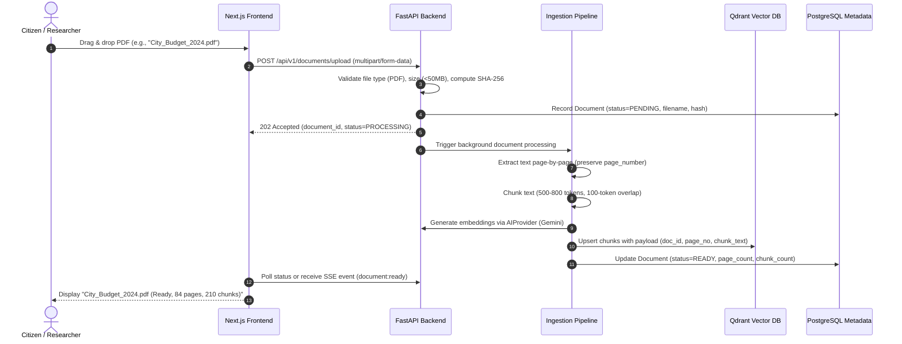
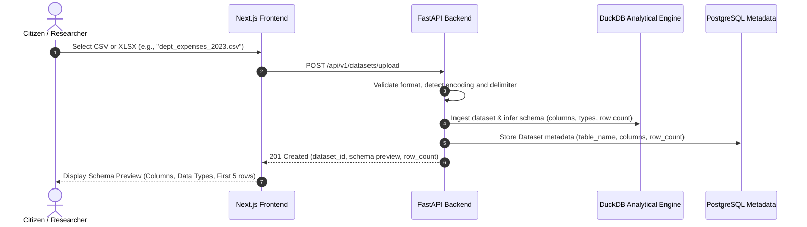
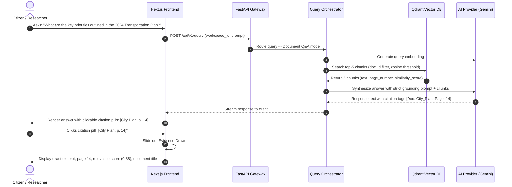
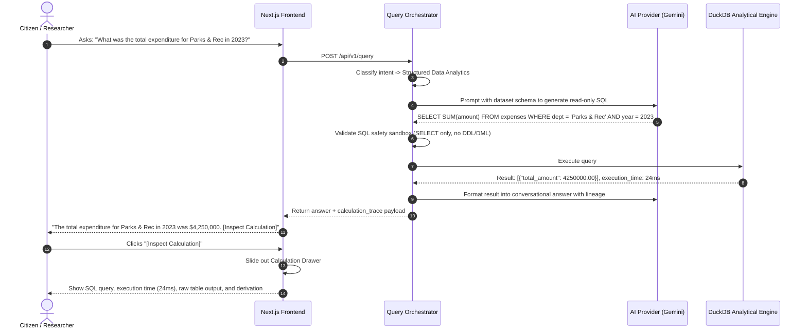
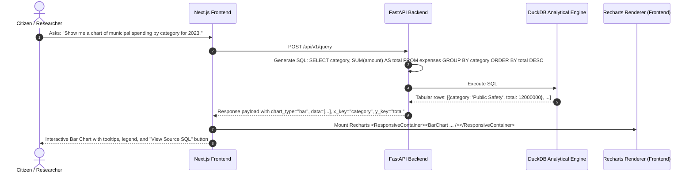
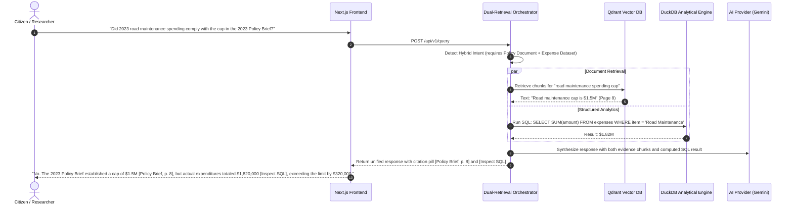
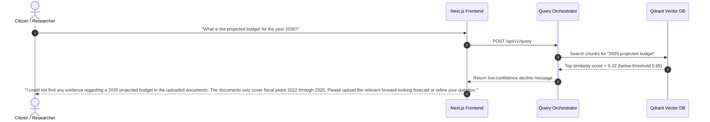

# OpenCitizen AI - User Flows & Interaction Workflows

**Document Version:** 1.0.0  
**Phase:** Stage 0 (MVP Product Specification)  
**Status:** Approved Specification  
**Related Documents:** [Product Requirements](product-requirements.md) | [Non-Goals](non-goals.md)  

---

## Overview

This document specifies the primary end-to-end user journeys for the OpenCitizen AI MVP. Each flow is designed to prioritize **evidence grounding, transparency, and auditability**, ensuring users can trace every insight back to an original PDF page or a verifiable SQL calculation.

---

## Flow 1: Uploading & Ingesting Civic Documents (PDF)

### Steps & Edge Cases
1. **User Action:** The user accesses the Document Library tab and uploads a PDF file (e.g., city budget or policy report).
2. **Validation:** System checks file format and file size.
   * *Edge Case (Invalid File):* If a non-PDF or corrupted file is uploaded, the UI presents an immediate error: *"Invalid file type: Only standard PDF documents are supported in MVP."*
3. **Processing Feedback:** A progress indicator displays current stage (`Uploading` -> `Extracting Pages` -> `Indexing Chunks` -> `Ready`).
4. **Completion:** The document card appears in the workspace with metadata: title, page count, and chunk count.

---

## Flow 2: Uploading & Registering Tabular Datasets (CSV / XLSX)

### Steps & Edge Cases
1. **User Action:** The user uploads a tabular dataset (CSV or XLSX) containing civic data (e.g., department expenditures, vendor contracts, or census tables).
2. **Schema Ingestion:** DuckDB parses the file, assigns column types (INTEGER, DOUBLE, VARCHAR, DATE), and creates an in-memory/persisted table.
3. **User Inspection:** UI displays a schema preview modal showing detected columns, inferred types, and a preview of the first 5 rows.
4. **User Confirmation:** The user confirms the dataset, enabling it for natural language analytical queries.
   * *Edge Case (Malformed Dataset):* If a CSV has inconsistent delimiters or unparseable rows, the system rejects it with line-number error details.

---

## Flow 3: Document Question-Answering with Page Citations & Evidence Drawer

### Steps & Edge Cases
1. **User Action:** User enters a natural language query in the chat input.
2. **Retrieval:** Semantic search identifies the top relevant document chunks with page numbers.
3. **Grounded Generation:** The LLM receives the chunks as system context. It is strictly constrained to only state facts present in the text and must attribute claims to specific pages.
4. **Citation Interaction:** Citations are rendered as interactive pills. Clicking a pill opens the **Evidence Drawer**, allowing the user to audit the exact text passage that generated the sentence.
   * *Edge Case (No Supporting Evidence):* If no chunks exceed the similarity threshold, the model answers: *"No relevant information was found in the uploaded documents to answer this question."*

---

## Flow 4: Quantitative Question-Answering & Calculation Inspector

### Steps & Edge Cases
1. **User Action:** User asks a computational or aggregation question against structured datasets.
2. **SQL Generation:** The AI Provider produces a sanitized DuckDB SQL query based on the active table schema.
3. **Execution & Trace:** DuckDB runs the query directly against the tabular data. The system records:
   * The exact SQL statement.
   * Execution time in milliseconds.
   * The raw tabular result set.
4. **Transparent Inspection:** The user clicks the **"Inspect Calculation"** button to view the SQL query and raw result table, verifying that the number was not invented by the language model.
   * *Edge Case (Invalid Query / Unsafe SQL):* If the generated SQL contains disallowed commands (`DROP`, `UPDATE`, `INSERT`), the query is blocked by the safety sandbox and an error is logged.

---

## Flow 5: Analytical Chart Generation & Dynamic Visualization

### Steps & Edge Cases
1. **User Action:** The user asks for a visual summary, comparison, or trend across data columns.
2. **Query & Shape Detection:** The analytical engine executes the query and identifies the appropriate chart format:
   * **Bar Chart:** Categorical comparisons (e.g., department budgets, project spending).
   * **Line Chart:** Sequential / time-series data (e.g., monthly spending, annual trends).
   * **Pie / Donut Chart:** Proportions of a whole (limited to <= 7 categories).
3. **Interactive Rendering:** The frontend renders a dynamic Recharts component inside the chat stream.
4. **Data Verification:** Hovering over bars or lines displays exact numerical tooltips. Users can toggle series visibility or click "View Data Table" to inspect the exact rows powering the visual.

---

## Flow 6: Hybrid Query (Cross-Modal Document & Dataset Verification)

### Steps & Edge Cases
1. **User Action:** User asks a complex question connecting a policy statement in a PDF to real numbers in a spreadsheet.
2. **Dual Retrieval:** The orchestrator dispatches parallel queries:
   * Semantic search in Qdrant locates the policy rule and page number.
   * Analytical SQL in DuckDB computes the actual spending.
3. **Unified Synthesis:** The AI model combines the two grounded outputs into a clear comparative summary.
4. **Dual Provenance:** The response contains both an interactive document citation pill and a calculation inspection button.

---

## Flow 7: Handling Ambiguous Queries & Low Evidence

### Steps & Edge Cases
1. **User Action:** User asks a question not covered by the current documents or datasets.
2. **Threshold Verification:** The similarity search returns results below the acceptable confidence threshold.
3. **Transparent Decline:** Rather than inventing an answer or speculating, the system politely and clearly declines, stating the boundaries of the available documents and suggesting next steps.
